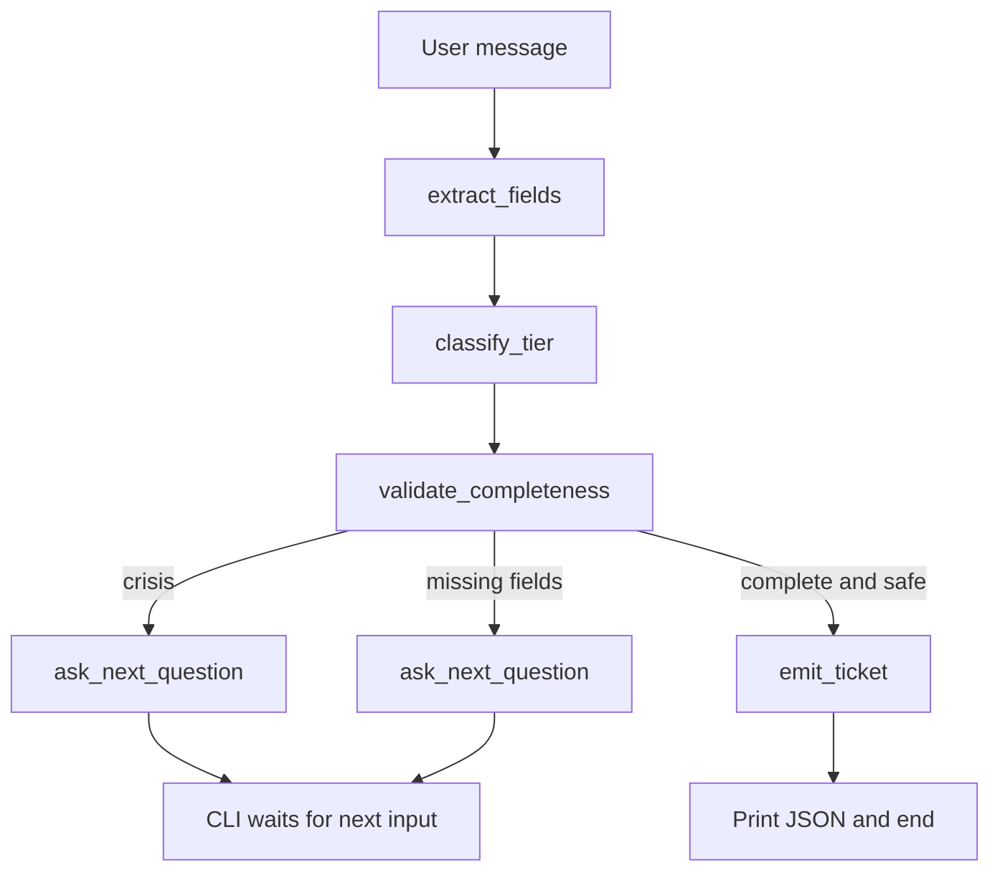

# Support Intake Agent

CLI prototype of a Spectrum-style **intake agent**: greet, classify a request into Tier 1/2/3, collect the required fields for that tier, refuse to route until the form is complete, then emit a structured JSON ticket.

This is the working MVP for a 3–4 hour take-home.

## Quick start

Python 3.11+ and either a local [Ollama](https://ollama.com) model **or** an OpenAI API key.

```bash
python3 -m venv .venv
source .venv/bin/activate
pip install -e ".[dev]"
cp .env.example .env
```

### Option A — Ollama (default)

```bash
ollama pull gemma4:26b
ollama pull gemma4:e4b
python -m intake_agent --script examples/greeting_then_wifi.txt
python -m intake_agent --script examples/jailbreak_redirect.txt
python -m intake_agent --script examples/refuse_password_share.txt
python -m intake_agent --script examples/tier1_password_reset.txt
intake-agent   # interactive
```

Use the **tagged** name Ollama actually lists (`gemma4:26b`, not `gemma4`). Untagged names like `gemma4` are mapped onto an installed `gemma4:*` tag.

The graph uses two Ollama transports so a large agent model does not block the turn:

- **Classify** (`OLLAMA_CLASSIFY_*`): extract + classify JSON. Default `gemma4:e4b`, `THINK=off`, smaller `NUM_CTX`.
- **Agent** (`OLLAMA_AGENT_*`): customer-facing reply. Default `gemma4:26b`, `THINK=on`, larger `NUM_CTX`.

See `.env.example` for the full knob list (`THINK`, `NUM_CTX`, `KEEP_ALIVE`, `TEMPERATURE`, `TOP_P`, `TOP_K`, `REPEAT_PENALTY`, `SEED`, `NUM_PREDICT`) on each prefix.

### Option B — OpenAI

```bash
# .env
LLM_PROVIDER=openai
OPENAI_API_KEY=sk-...
OPENAI_AGENT_MODEL=gpt-4o-mini
OPENAI_CLASSIFY_MODEL=gpt-4o-mini
```

```bash
python -m intake_agent
```

Optional LangSmith tracing (not required):

```bash
LANGCHAIN_TRACING_V2=true
LANGCHAIN_API_KEY=...
LANGCHAIN_PROJECT=support-intake-agent
```

### Tests (no LLM)

```bash
pytest -q
```

Live evals replay every `examples/*.txt` script through the real graph and score the ticket (tier, name, account, keywords, secrets not stored, min turns):

```bash
python -m intake_agent.eval
# or
pytest --eval -q
```

Filter with `--only wifi` / `--only jailbreak`. Default `pytest -q` skips the live cases.

## Interactive CLI

`intake-agent` uses a `❯` prompt. Shift+Return inserts a newline; Return submits. After you press Return there is a blank line, then a braille spinner (`⠋⠙⠹⠸⠼⠴⠦⠧⠇⠏`) with `loading...`. If the model streams think/reasoning tokens, the label becomes `thinking N tokens` and the think text is **not** shown. The first visible token replaces the throbber with word-wrapped markdown (bold, italic, headers, quotes, code, tables). Resize reflows the current assistant block.

Slash commands (`/exit`, `quit`, `/clear`, `/status`, `/save`) are handled by the CLI, not the model. Details: [docs/cli.md](docs/cli.md).

`--script` uses the same `❯` spacing for demos; the throbber is TTY-interactive only.

Details: [docs/overview.md](docs/overview.md), [docs/architecture.md](docs/architecture.md), [docs/cli.md](docs/cli.md).

## What it does

A customer talks in natural language. Each turn the graph:

1. **Extracts** any intake slots mentioned (and corrections).
2. **Classifies** Tier 1 / 2 / 3 with a written reason.
3. **Validates** completeness in Python against the required-field matrix.
4. Either **asks for the next missing field** or **emits a ticket** and stops.

| Field | Tier 1 | Tier 2 | Tier 3 |
| --- | --- | --- | --- |
| Customer name | yes | yes | yes |
| Account number | yes | yes | yes |
| Issue summary | yes | yes | yes |
| Category | | yes | yes |
| Steps already tried | | yes | yes |
| Impact scope | | | yes |
| Urgency | | | yes |
| Affected systems | | | yes |

Scripted flows in `examples/` are one user answer per turn, in the same order the agent asks (`issue_summary`, then name, account, and any Tier 2/3 slots). A packed last line is only a fallback if the model skipped a field.

- `greeting_then_wifi.txt` — warm hello, then Tier 2 wifi troubleshooting
- `tier1_password_reset.txt` — self-service password reset
- `tier2_billing_dispute.txt` — standard-support billing
- `tier2_speed_upgrade.txt` — service modification
- `correction_name.txt` — mid-conversation name overwrite
- `jailbreak_redirect.txt` — refuse a jailbreak, then continue intake
- `refuse_password_share.txt` — pasted password is not stored
- `tier3_outage.txt` — regional outage escalation
- `tier3_account_compromised.txt` — security escalation
- `reclassify_billing_to_outage.txt` — mid-conversation tier-up
- `tier_down_outage_to_password.txt` — suspected outage that is really a login problem

On completion the CLI prints a ticket like:

```json
{
  "tier": 1,
  "routing_team": "self_service",
  "classification_reasoning": "Password reset is FAQ / self-service.",
  "customer_name": "Jane Doe",
  "account_number": "44556677",
  "issue_summary": "Forgot Spectrum password and cannot log in",
  "category": null,
  "steps_already_tried": null,
  "impact_scope": null,
  "urgency": null,
  "affected_systems": null,
  "status": "ready_for_routing"
}
```

## Architecture

**LLM for language, Python for control.** The model classifies, extracts, and talks. It does not decide whether the ticket is complete, which fields a tier requires, or what JSON gets emitted.



Each CLI turn is one `graph.stream(...)`. The graph does not block waiting for a human; the CLI loop is the interrupt. Session state lives in a LangGraph `MemorySaver` checkpointer keyed by `thread_id`. Extract/classify JSON is hidden; only `respond` (and the emit confirmation) is streamed to the terminal.

| Piece | Module | Who owns it |
| --- | --- | --- |
| Slot merge, required fields, completeness | `rules.py` | Python |
| Ticket JSON | `rules.build_ticket` | Python |
| Jailbreak / secret / crisis rails | `safety.py` | Python |
| Account lookup / FAQ search | `tools.py` | Python (stubs) |
| Extract / classify / reply | `graph.py` nodes + `prompts.py` | LLM |

Tools are called from `validate_completeness` once an account number or issue summary appears. They are **not** bound onto a ReAct agent. That keeps the control flow on the graph, where a reviewer can read it.

## Why LangGraph (and not the alternatives)

The rubric weights orchestration (30%) and state (20%). An explicit `StateGraph` is the artifact we would walk in a design discussion:

- **vs a raw `while` loop + chat API:** a loop works, but branching, reducers, and a checkpointer would be invented by hand. LangGraph is that loop with named nodes, conditional edges, and a persistence hook.
- **vs `create_agent` / ReAct:** a tool-calling loop hides the decision-making inside the model. This assignment asks for followable state transitions (classify → collect → validate → emit). The model should not be allowed to skip validation.
- **vs a Cursor skill / MCP server / static GitHub Pages UI:** the requested demo is `pip install` + a conversation. Those packaging choices fail that path and spend the time budget on transport.

Ollama is the default so the prototype runs offline. The same graph takes `ChatOpenAI` when `LLM_PROVIDER=openai`, still as two transports (`OPENAI_CLASSIFY_MODEL` for extract/classify, `OPENAI_AGENT_MODEL` for the reply).

## Design decisions

**Corrections.** Extraction only returns fields the user stated this turn. `merge_extraction` overwrites a slot when a new filled value arrives and never clears a slot because the model omitted it. "Actually my name is Jane Doe-Chen" replaces the name; silence does not wipe the account number.

**Re-classification.** `classify_tier` runs every turn. If a billing complaint becomes a regional outage, required fields expand and the agent keeps collecting. If a suspected outage is really a password reset, extra T3 slots stay on the ticket but are not required for emit (`test_tier_down_does_not_block_emit`).

**One question at a time.** `next_missing_field` is the first hole in the tier's required tuple. The respond node is instructed to ask only for that field.

**Guardrails.** Python scans each turn in `safety.py`. Jailbreaks force `off_topic` even if the model disagrees. Pasted passwords, SSNs, and card numbers are stripped from slots. Crisis language blocks emit and the respond node points to 988. The system prompt still forbids resolving the issue, inventing account data, and asking for secrets.

**Structured output.** Extract and classify must return Pydantic objects. OpenAI uses native `with_structured_output`. Ollama's tool-calling path often returns empty objects when most fields are optional, so local models are bound with `format="json"` and validated by Pydantic, with one retry. Failure raises a clear error instead of silently inventing slots.

## What we cut on purpose

No web UI, GitHub Pages, Cursor skill, or MCP server. No live billing APIs, auth, or a token dashboard. Persistence is in-process `MemorySaver` only. Those are the right cuts for a 3–4 hour MVP; several of them are the natural "what I'd add next" answers below.

## What I'd add with more time / at scale

- **Persistence and concurrency.** Swap `MemorySaver` for a Postgres checkpointer. Each conversation is already a `thread_id`; 100 concurrent sessions are 100 thread IDs against the same compiled graph (the graph is a stateless function; state is in the checkpointer).
- **Ticketing.** `emit_ticket` becomes an HTTP POST to ServiceNow / Remedy with retries and an idempotency key. The JSON shape is the contract.
- **Observability.** LangSmith (or OpenTelemetry) on each node: traces, token usage, classification drift.
- **Evals.** Prompt-version golden transcripts with a cheap model in CI. The local harness is already `python -m intake_agent.eval`.
- **Prompt versioning.** Treat `prompts.py` as a policy pack with an id, so a bad prompt can be rolled back without a graph rewrite.
- **Human-in-the-loop.** LangGraph interrupts before emit for Tier 3, so an analyst confirms impact/urgency.

## Layout

```
src/intake_agent/
  eval.py       replay examples/ and score tickets
  cli.py        interactive + --script
  commands.py   slash commands: exit, clear, status, save
  graph.py      StateGraph nodes and compile
  rules.py      required fields, merge, ticket
  safety.py     jailbreak / secret / crisis scanners
  schemas.py    Pydantic Extraction / Classification / Ticket
  state.py      IntakeState TypedDict
  prompts.py    system + node instructions
  llm.py        Ollama / OpenAI factory
  tools.py      stub lookup_account + search_kb
  terminal/     throbber, markdown, wrap, SIGWINCH
docs/           overview, architecture, CLI UX
examples/
tests/
```

## Follow-up talking points

How you'd extend this is mostly already named in the graph: persistence is the checkpointer, fan-out is `thread_id`, and the ticketing system is the emit node. The field matrix in `REQUIRED_BY_TIER` is data — adding Tier 4 or a new slot should not require rewriting the conversation loop.
