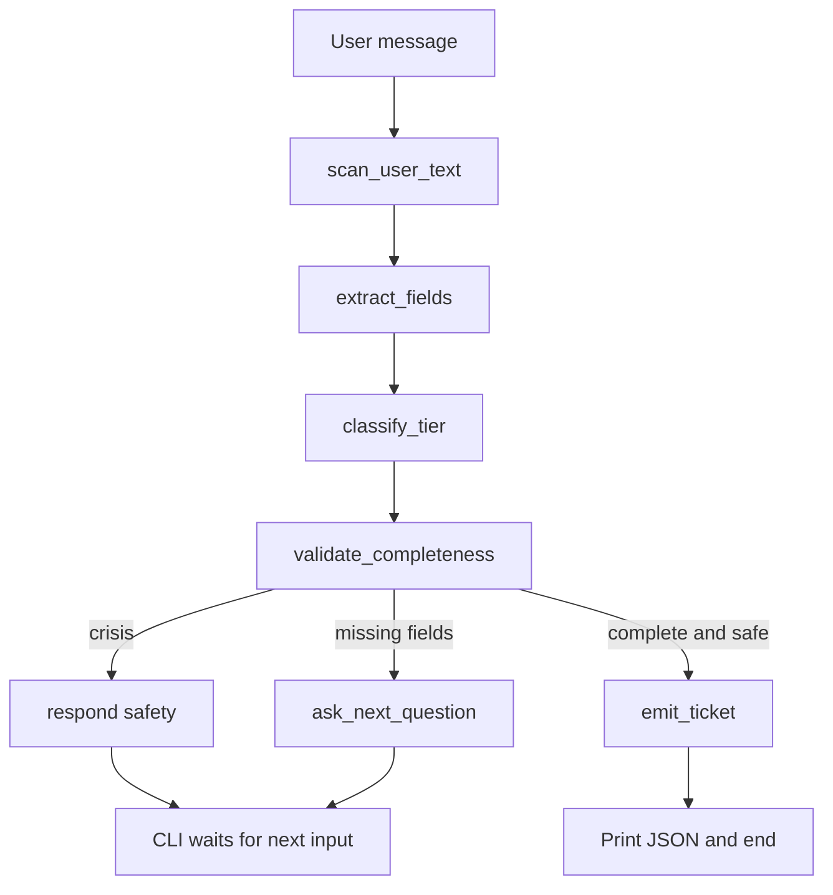

# Architecture

## Principle

**LLM for language, Python for control.** Classification, field extraction, and customer-facing replies are model nodes. Completeness, the required-field matrix, correction merge, ticket JSON, and safety scans are deterministic Python. The model cannot skip validation, invent a ticket, or override a jailbreak / crisis / secret rail.

Each CLI turn is one `graph.stream(...)`. The graph does not block on the human; the CLI loop is the interrupt. Session state is a LangGraph `MemorySaver` keyed by `thread_id`.

## State vs schemas

- `IntakeState` (TypedDict) is the graph container. `messages` uses the `add_messages` reducer; slots overwrite.
- Pydantic models (`Extraction`, `Classification`, `Ticket`) are for LLM output and the final payload only.

Required fields:

- All tiers: name, account number, issue summary
- Tier 2+: category, steps already tried
- Tier 3: impact scope, urgency, affected systems

`classify_tier` is skipped until `issue_summary` is filled, so a greeting like `hi` does not force a tier. The respond node gets a Python `phase` (`greeting`, `steer`, `intake`, or `safety`) so only the first reply is a welcome; later turns without an issue steer back to intake without re-saying hello. Respond sees recent chat turns plus a control block; extract and classify still get a slot snapshot. Classification re-runs every turn once there is an issue, so new facts can raise or lower the tier. Extra slots from a previous higher tier stay on the ticket but are not required after a tier-down.

## Safety

`safety.py` scans the latest user text before slots are merged:

- Jailbreak phrases force `off_topic` even if extract disagrees.
- Passwords, SSNs, and payment-card numbers are stripped from extracted slots (`safety_secret`).
- Crisis language sets `safety_crisis`, drops that turn's issue summary, and **blocks emit**. The respond node points to 988.

These are keyword rails, not a moderation model.

## Tools

`lookup_account` and `search_kb` are stub Python functions invoked from `validate_completeness` after an account number or issue summary appears. They are not bound onto a ReAct loop.

## Evals

`python -m intake_agent.eval` replays each `examples/*.txt` script through the compiled graph (`graph.invoke` per turn, same extract → classify → validate → respond/emit path as the CLI). Scoring is Python: tier, routing team, name, account, keyword checks on the issue, forbidden secrets, and a minimum turn count so a greeting or jailbreak cannot emit on turn 1. Default `pytest -q` tests the scorer without a model; `pytest --eval` runs the live cases.

## Streaming vs structured nodes

Extract and classify use the classify transport (typically a small model with `OLLAMA_CLASSIFY_THINK=off`). They stream internally so any think/reasoning tokens can update the CLI throbber, but their JSON is never printed. Only the `respond` node (agent transport) and the short `emit` confirmation are visible. See [cli.md](cli.md).

## Scale hooks already in the graph

- Persistence: swap `MemorySaver` for a Postgres checkpointer; `thread_id` is the session key.
- Concurrency: the compiled graph is stateless; one hundred sessions are one hundred thread IDs.
- Ticketing: `emit_ticket` is the seam for POST to ServiceNow / Remedy.
